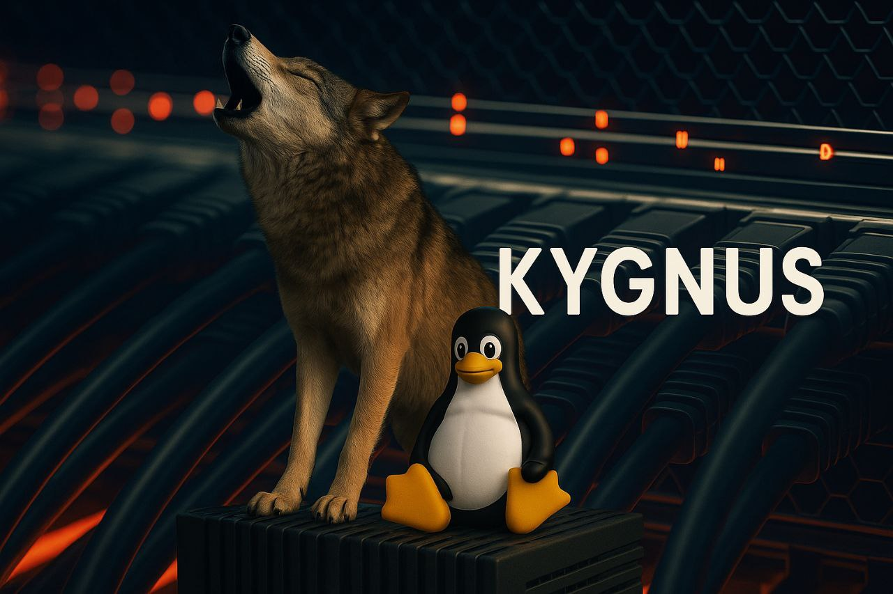

# myfw - Enterprise Next-Generation Firewall



myfw is a robust, enterprise-grade Next-Generation Firewall (NGFW) solution for Linux systems, built on Debian. It integrates advanced intrusion detection and prevention (Suricata, Maltrail), dynamic threat blocking (Fail2Ban), real-time monitoring (Netdata), and a powerful firewall management system (UFW). Optimized for high-performance and security, myfw is designed for enterprise environments requiring scalable, reliable, and secure network protection.

## Features

- **Intrusion Detection and Prevention (IDS/IPS)**:
  - Suricata for real-time traffic analysis and threat detection.
  - Maltrail for identifying malicious traffic patterns.
  - Fail2Ban for automated IP banning based on suspicious activity.
- **Firewall Management**:
  - UFW-based rule management for port and service-based policies.
  - Panic mode to block all traffic during critical incidents.
- **Real-Time Monitoring**:
  - Netdata for comprehensive system and network performance monitoring.
  - Optional Netdata Cloud integration for centralized monitoring.
- **Kernel Optimizations**:
  - Enterprise-grade Linux kernel tuning for high-throughput networks, DDoS mitigation, and security hardening.
- **Extensibility**:
  - Modular control script (`myfw`) for managing firewall, IDS/IPS, and monitoring components.
  - Custom rule support for Suricata and Fail2Ban.
- **Logging and Alerts**:
  - Centralized logging with rotation for auditability.
  - Email alerts for critical events (configurable).

## Prerequisites

- **Operating System**: Debian 11 or 12
- **Hardware**:
  - Minimum: 4 CPU cores, 8GB RAM, 40GB SSD
  - Recommended: 8+ CPU cores, 16GB+ RAM, 100GB+ SSD
- **Network**: At least one network interface for traffic monitoring
- **Permissions**: Root access (`sudo`) for installation and management
- **Dependencies**:
  - Python 3.11 (installed by the setup script)
  - Internet access for package installation and updates

## Installation

1. **Clone the Repository**:
   ```bash
   git clone https://github.com/KYGnus/myfw.git
   cd myfw
   ```

2. **Run the Installer**:
   The `setup` script automates the setup of myfw, including dependencies, kernel optimizations, and service configurations.
   ```bash
   chmod +x setup
   sudo ./setup
   ```

   The installer performs the following:
   - Updates the system and installs dependencies (`firewalld`, `suricata`, `fail2ban`, `netdata`, `python3.11`, etc.).
   - Installs Maltrail with Python 3.11 and configures systemd services.
   - Applies enterprise-grade kernel optimizations.
   - Configures logging, email alerts, and log rotation.
   - Sets up the `myfw` control script.

3. **Verify Installation**:
   - Check service status:
     ```bash
     sudo systemctl status suricata maltrail-server maltrail-sensor fail2ban netdata
     ```
   - Access Netdata dashboard: `http://<server-ip>:19999`
   - View installation log: `/var/log/ngfw-installer.log`

## Usage

The `myfw` control script provides a unified interface to manage myfw components. Run it with `sudo`:
```bash
sudo myfw --help
```

### Examples

1. **Add a Firewall Rule**:
   Allow SSH traffic on port 22:
   ```bash
   sudo myfw --firewall rule --add-port 22 --proto tcp
   ```

2. **Start Suricata IDS**:
   ```bash
   sudo myfw --ids suricata --start
   ```

3. **Add a Custom Suricata Rule**:
   ```bash
   sudo myfw --ids suricata --add-rule 'alert tcp any any -> any any (msg:"Test Rule"; sid:1000001;)'
   ```

4. **Start Maltrail**:
   ```bash
   sudo myfw --ids maltrail --start
   ```

5. **View Maltrail Logs**:
   ```bash
   sudo myfw --ids maltrail --logs --sensor
   ```

6. **Manage Fail2Ban**:
   Add a new jail for SSH:
   ```bash
   sudo myfw --ips fail2ban --add-jail ssh sshd
   ```
   List banned IPs:
   ```bash
   sudo myfw --ips fail2ban --ban-list
   ```

7. **Enable Panic Mode**:
   Block all traffic:
   ```bash
   sudo myfw --firewall panic --enable
   ```

8. **Monitor with Netdata**:
   Start Netdata:
   ```bash
   sudo myfw --monitor netdata --start
   ```
   Access the dashboard at `http://<server-ip>:19999`.

## Kernel Optimizations

myfw applies enterprise-grade kernel optimizations to ensure high performance, scalability, and security. Below is a summary of key parameters configured in `/etc/sysctl.conf`:

- **Socket Buffers**:
  - `net.core.rmem_max=33554432`, `net.core.wmem_max=33554432`: Large buffers for high-throughput networks.
  - `net.core.rmem_default=8388608`, `net.core.wmem_default=8388608`: Balanced defaults for most connections.
  - `net.core.optmem_max=81920`: Supports larger socket options.

- **TCP Connection Handling**:
  - `net.ipv4.tcp_syncookies=1`: Protects against SYN flood attacks.
  - `net.ipv4.tcp_max_syn_backlog=16384`: Handles high connection rates.
  - `net.core.somaxconn=131072`: Large listen queue for incoming connections.
  - `net.ipv4.tcp_tw_reuse=1`: Reuses TIME_WAIT sockets.
  - `net.ipv4.tcp_fin_timeout=15`: Frees resources quickly.
  - `net.ipv4.tcp_keepalive_*`: Detects dead connections efficiently.

- **Connection Tracking**:
  - `net.netfilter.nf_conntrack_max=262144`: Supports large-scale traffic.
  - `net.ipv4.netfilter.ip_conntrack_tcp_timeout_*`: Optimizes connection timeouts.

- **DDoS Mitigation**:
  - `net.ipv4.tcp_max_orphans=32768`: Limits orphaned sockets.
  - `net.ipv4.ip_local_port_range=1024 65535`: Expands ephemeral ports.
  - `net.ipv4.tcp_rfc1337=1`: Prevents TIME_WAIT assassination.
  - `net.core.netdev_max_backlog=5000`: Handles high-speed interfaces.

- **IPv6**:
  - Disabled by default (`net.ipv6.conf.*.disable_ipv6=1`) to reduce attack surface. Comment out if IPv6 is needed.

- **Memory and CPU**:
  - `vm.swappiness=10`: Prioritizes RAM usage.
  - `vm.dirty_ratio=15`, `vm.dirty_background_ratio=5`: Optimizes memory writeback.
  - `kernel.sched_migration_cost_ns=5000000`: Reduces CPU migration overhead.

- **Security Hardening**:
  - `net.ipv4.conf.*.rp_filter=1`: Prevents IP spoofing.
  - `net.ipv4.conf.*.accept_redirects=0`, `net.ipv4.conf.*.secure_redirects=0`: Disables ICMP redirects.
  - `net.ipv4.icmp_echo_ignore_broadcasts=1`: Mitigates smurf attacks.
  - `net.ipv4.conf.all.log_martians=1`: Logs invalid packets.

For detailed explanations, refer to the comments in `/etc/sysctl.conf` after running `ngfw-installer.sh`.

## Configuration

- **Email Alerts**: Edit `/etc/myfw/email.conf` to set `ALERT_EMAIL` for notifications.
- **Suricata Rules**: Add custom rules to `/etc/suricata/rules/local.rules`.
- **Maltrail Logs**: Located in `/var/log/maltrail/`.
- **Fail2Ban Jails**: Configured in `/etc/fail2ban/jail.d/`.
- **Netdata Dashboard**: Access at `http://<server-ip>:19999`.

## Security Considerations

- Regularly update Suricata rules (`sudo myfw --ids suricata --update`) and Maltrail (`sudo myfw --ids maltrail --update`).
- Monitor logs (`/var/log/ngfw-installer.log`, `/var/log/maltrail/*.log`, `/var/log/suricata/fast.log`).
- Test configurations under load using tools like `hping3` or `iperf`.
- Ensure compliance with standards (e.g., PCI-DSS, HIPAA) by reviewing kernel settings and firewall rules.

## Contributing

Contributions are welcome! To contribute:
1. Fork the repository.
2. Create a feature branch (`git checkout -b feature/your-feature`).
3. Commit changes (`git commit -m 'Add your feature'`).
4. Push to the branch (`git push origin feature/your-feature`).
5. Open a Pull Request.

Please ensure your code follows the project's style and includes tests where applicable.

## License

This project is licensed under the MIT License. See the [LICENSE](LICENSE) file for details.

## Support

For issues, feature requests, or questions, open an issue on GitHub or contact the maintainer at `kygnus.co@proton.me`.
