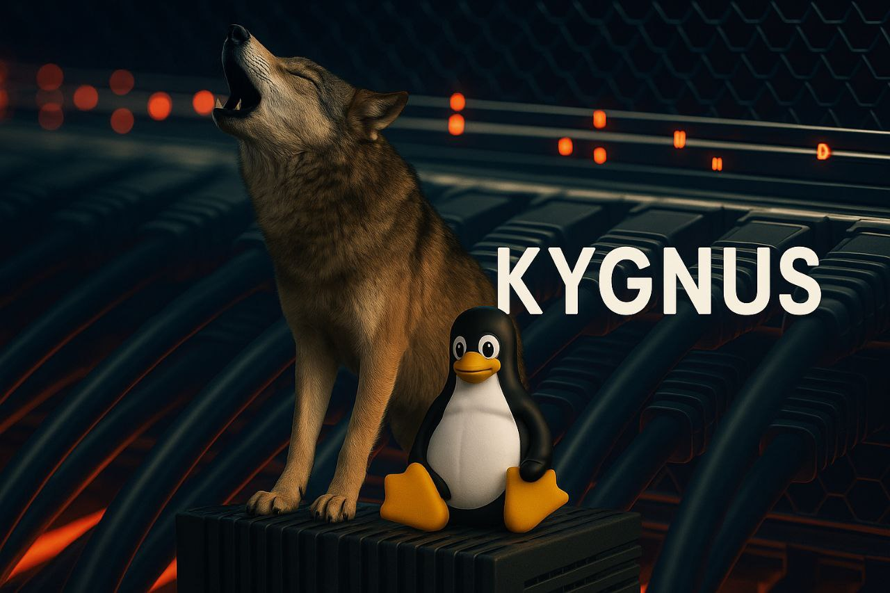

# myfw — Enterprise Linux Firewall & Security Framework




**myfw** is a Bash-based enterprise Linux firewall and security management framework built around the Linux kernel networking stack and **nftables**.

It provides a unified command-line interface for firewall policy management, stateful packet filtering, IPv4/IPv6 security, dynamic threat blocking, NAT, firewall backups, audit logging, and integration with security systems such as **Suricata**, **Fail2Ban**, and **conntrack**.

myfw is designed for servers, gateways, security appliances, laboratories, enterprise infrastructure, and Linux systems where a lightweight CLI-driven security framework is preferred over a large graphical management layer.

---

## Architecture

myfw is intentionally implemented as a **Bash-first management framework**.

The architecture separates the management layer from the Linux networking and security engines:

```text
                         +----------------------+
                         |       myfw CLI       |
                         |        Bash          |
                         +----------+-----------+
                                    |
              +---------------------+---------------------+
              |                     |                     |
              v                     v                     v
        +-----------+         +-----------+         +-----------+
        | nftables  |         | conntrack |         |  system  |
        | Firewall  |         |   State   |         | services |
        +-----------+         +-----------+         +-----------+
              |
      +-------+--------+
      |                |
      v                v
   Filtering          NAT
   IPv4/IPv6          DNAT
   Sets               Masquerade
   Rate limits        Routing
   Logging
              |
      +-------+----------------------+
      |                              |
      v                              v
 +-----------+                 +-----------+
 | Suricata  |                 | Fail2Ban  |
 | IDS / IPS |                 | Dynamic   |
 +-----------+                 | Blocking  |
                              +-----------+
```

### Core components

| Component | Purpose                               |
| --------- | ------------------------------------- |
| Bash      | Management and orchestration layer    |
| nftables  | Firewall and packet filtering engine  |
| conntrack | Stateful connection tracking          |
| iproute2  | Network/interface management          |
| Suricata  | IDS/IPS and network threat detection  |
| Fail2Ban  | Automated dynamic IP blocking         |
| Maltrail  | Optional malicious traffic monitoring |
| Netdata   | Optional infrastructure monitoring    |

---

# Features

## Firewall

myfw uses **nftables** as its primary firewall engine.

Features include:

* Stateful packet filtering
* IPv4 firewall policies
* IPv6 firewall policies
* INPUT policy management
* FORWARD policy management
* OUTPUT policy management
* TCP/UDP port rules
* Source address filtering
* Destination address filtering
* CIDR network support
* Interface-based rules
* Firewall sets
* Dynamic blocklists
* Rate limiting
* Connection tracking
* Firewall logging
* Atomic ruleset validation
* Firewall configuration backups
* Panic/lockdown mode

---

## IPv4 and IPv6

myfw supports both IPv4 and IPv6 firewall policy management.

IPv6 can be controlled through:

```text
/etc/myfw/myfw.conf
```

Example:

```bash
MYFW_ENABLE_IPV6="yes"
```

For systems that do not require IPv6, it can be disabled according to the system's security and networking requirements.

---

# Dynamic Threat Blocking

myfw provides a blocklist mechanism for dynamically denying hostile addresses.

Example:

```bash
sudo myfw block add 203.0.113.10
```

Temporary block:

```bash
sudo myfw block add 203.0.113.10 --timeout 1h
```

List blocked addresses:

```bash
sudo myfw block list
```

The dynamic blocking architecture can be used by security integrations and automated response mechanisms.

---

# Suricata IDS/IPS

myfw integrates with **Suricata** for network intrusion detection and prevention.

Suricata can inspect network traffic and generate security events independently of the base nftables firewall policy.

Typical operations include:

```bash
sudo myfw ids suricata status
```

Start Suricata:

```bash
sudo myfw ids suricata start
```

Update Suricata rules:

```bash
sudo myfw ids suricata update
```

Add a local detection rule:

```bash
sudo myfw ids suricata rule add 'alert tcp any any -> any any (msg:"Test Rule"; sid:1000001;)'
```

For IPS deployments, myfw can integrate Suricata with nftables/NFQUEUE.

---

# Fail2Ban

Fail2Ban provides dynamic response to repeated authentication failures and other configurable security events.

Check Fail2Ban:

```bash
sudo myfw ips fail2ban status
```

View banned addresses:

```bash
sudo myfw ips fail2ban ban-list
```

Unban an address:

```bash
sudo myfw ips fail2ban unban 203.0.113.10
```

Add a jail:

```bash
sudo myfw ips fail2ban add-jail ssh sshd
```

Fail2Ban operates as a complementary response layer rather than replacing the nftables firewall.

---

# conntrack

myfw uses the Linux connection-tracking subsystem for stateful firewall operation.

Connection tracking allows firewall policies to distinguish between:

```text
NEW
ESTABLISHED
RELATED
INVALID
```

This is fundamental for stateful filtering and NAT.

Connection tracking information can also be inspected directly from the system:

```bash
sudo conntrack -L
```

---

# NAT

myfw supports network address translation through nftables.

Example masquerading configuration:

```bash
sudo myfw nat masquerade 192.168.1.0/24 eth0
```

This can be used for Linux systems operating as:

* Routers
* Gateways
* NAT appliances
* Laboratory gateways
* Private network gateways

DNAT/port-forwarding functionality can also be managed through the firewall policy layer where supported by the installed myfw version.

---

# Firewall Policies

The default policy can be configured through:

```text
/etc/myfw/myfw.conf
```

Example:

```bash
INPUT_POLICY="drop"
FORWARD_POLICY="drop"
OUTPUT_POLICY="accept"
```

This provides a common server/gateway security model:

```text
INPUT    -> DROP
FORWARD  -> DROP
OUTPUT   -> ACCEPT
```

Rules should then explicitly permit required services.

---

# Firewall Rules

Allow SSH:

```bash
sudo myfw rule allow --port 22 --proto tcp
```

Allow HTTPS:

```bash
sudo myfw rule allow --port 443 --proto tcp
```

Allow HTTP:

```bash
sudo myfw rule allow --port 80 --proto tcp
```

Always validate firewall configuration before applying changes:

```bash
sudo myfw policy validate
```

Then apply:

```bash
sudo myfw policy apply
```

---

# Panic Mode

myfw provides a panic/lockdown mechanism for emergency response.

Panic mode is intended for situations where immediate network isolation is required.

Example:

```bash
sudo myfw panic enable
```

The exact behavior depends on the current firewall state and configured rollback policy.

Configuration:

```bash
PANIC_ROLLBACK="0"
```

For production systems, administrators should test the panic and rollback behavior before relying on it during an incident.

---

# Configuration

The primary configuration file is:

```text
/etc/myfw/myfw.conf
```

Example configuration:

```bash
MYFW_ENABLE_IPV6="yes"

INPUT_POLICY="drop"
FORWARD_POLICY="drop"
OUTPUT_POLICY="accept"

ENABLE_LOGGING="yes"
LOG_PREFIX="MYFW"

SSH_PORT="22"

MANAGEMENT_NETWORK=""

WAN_INTERFACE=""

LAN_INTERFACE=""

SURICATA_QUEUE="0"

PANIC_ROLLBACK="0"
```

---

# Directory Layout

After installation, myfw uses the following structure:

```text
/etc/myfw/
├── myfw.conf
├── rules/
├── sets/
└── backups/

/var/lib/myfw/
├── state/
└── feeds/

/var/log/myfw/

/run/myfw/

/usr/bin/myfw
```

### Configuration

```text
/etc/myfw/
```

Persistent administrator configuration, firewall rules, sets, and backups.

### Runtime state

```text
/var/lib/myfw/
```

Runtime and persistent application state.

### Threat feeds

```text
/var/lib/myfw/feeds/
```

Location for downloaded or generated security intelligence.

### Logs

```text
/var/log/myfw/
```

myfw operational and audit logs.

### Runtime files

```text
/run/myfw/
```

Temporary runtime information and locking/state data.

---

# Installation

## Option 1 — Debian Package

The repository contains a Debian package builder:

```text
build-deb
```

Build the package:

```bash
chmod +x build-deb
./build-deb
```

The resulting package is created under:

```text
dist/
```

For example:

```text
dist/myfw_3.0.0_amd64.deb
```

Install using APT:

```bash
sudo apt install ./dist/myfw_3.0.0_amd64.deb
```

Using APT is recommended because it resolves Debian package dependencies automatically.

The package declares the core runtime security stack, including:

```text
bash
nftables
iproute2
procps
util-linux
conntrack
suricata
suricata-update
fail2ban
```

Optional integrations such as Maltrail and Netdata may be provided separately depending on the target Debian distribution and repository configuration.

---

# Building the Debian Package

The repository is intentionally simple:

```text
myfw/
├── build-deb
├── dist/
│   └── myfw_3.0.0_amd64.deb
├── firewall.jpg
├── LICENSE
├── myfw
└── README.md
```

The build process performs:

1. Debian host verification
2. Build dependency verification
3. Source validation
4. Bash syntax validation
5. Package tree creation
6. Configuration installation
7. Debian metadata generation
8. Dependency declaration
9. Debian package construction
10. Package information verification

Build:

```bash
./build-deb
```

Clean build files:

```bash
./build-deb --clean
```

Build with a specific version:

```bash
./build-deb --version 3.0.1
```

Disable automatic installation of build dependencies:

```bash
./build-deb --no-build-deps
```

---

# First Configuration

After installation, review:

```bash
sudo nano /etc/myfw/myfw.conf
```

Check the firewall configuration:

```bash
sudo myfw policy validate
```

Check system information:

```bash
sudo myfw info
```

Check current status:

```bash
sudo myfw status
```

Only apply the firewall after verifying that the policy will not lock you out of the system:

```bash
sudo myfw policy apply
```

---

# Recommended Deployment Procedure

For a remote production server, use the following workflow:

```text
                 Configuration
                       |
                       v
               policy validate
                       |
                       v
                Backup state
                       |
                       v
                Apply firewall
                       |
                       v
               Verify connectivity
                       |
                       v
                Monitor events
```

Example:

```bash
sudo myfw info
sudo myfw status
sudo myfw policy validate
sudo myfw policy apply
sudo myfw status
```

When managing a remote server, ensure SSH access is explicitly permitted before applying a restrictive INPUT policy.

---

# Security Model

myfw follows a layered security architecture:

```text
+------------------------------------------------------+
|                  Application Layer                   |
+------------------------------------------------------+
|                    myfw CLI                          |
+------------------------------------------------------+
|             Security Response Layer                  |
|            Fail2Ban / Dynamic Blocks                 |
+------------------------------------------------------+
|              Network Detection Layer                 |
|                  Suricata IDS/IPS                    |
+------------------------------------------------------+
|                Stateful Network Layer                |
|                 conntrack / NAT                      |
+------------------------------------------------------+
|                Packet Filter Layer                   |
|                    nftables                          |
+------------------------------------------------------+
|                 Linux Kernel                         |
+------------------------------------------------------+
|                    Network                           |
+------------------------------------------------------+
```

This allows each component to perform a specific security function rather than attempting to implement all functionality inside the Bash management layer.

---

# Logging and Auditing

myfw stores its application logs under:

```text
/var/log/myfw/
```

The nftables firewall can also generate kernel/network security logs according to the configured rules.

For Suricata, inspect the Suricata log directory configured by the installed Suricata package.

For Fail2Ban:

```bash
sudo fail2ban-client status
```

For connection tracking:

```bash
sudo conntrack -L
```

---

# Backup and Recovery

Firewall configuration backups are stored under:

```text
/etc/myfw/backups/
```

Before making significant production firewall changes, maintain a known-good configuration.

A recommended operational procedure is:

```bash
sudo myfw policy validate
```

followed by:

```bash
sudo myfw policy apply
```

Administrators should also maintain external configuration backups for critical infrastructure.

---

# Enterprise Deployment

myfw can be deployed in several network roles.

## Linux Server

```text
Internet
   |
   v
+--------+
| myfw   |
| Server |
+--------+
   |
 Applications
```

## Gateway

```text
                 Internet
                    |
                    v
              +-----------+
              |   myfw    |
              | nftables  |
              +-----+-----+
                    |
                 LAN
                    |
          +---------+---------+
          |         |         |
        Host      Host      Server
```

## Security Gateway

```text
Internet
    |
    v
+----------------------+
|       nftables       |
+----------+-----------+
           |
+----------v-----------+
|      Suricata        |
|       IDS/IPS        |
+----------+-----------+
           |
+----------v-----------+
|      Fail2Ban        |
| Dynamic Response     |
+----------+-----------+
           |
           v
        Internal
        Network
```

---

# Performance Considerations

myfw is a management framework rather than a replacement for the Linux kernel networking subsystem.

Packet processing is performed by the kernel's networking stack and nftables.

Performance depends on:

* CPU architecture
* CPU frequency
* Network interface speed
* NIC driver
* nftables rule complexity
* Number of rules and sets
* conntrack table size
* Suricata inspection workload
* Logging volume
* Storage performance
* Traffic patterns

Suricata IPS inspection can introduce substantially more CPU overhead than basic nftables filtering and should therefore be benchmarked according to the deployment environment.

---

# Production Hardening

Before production deployment:

* Define an explicit management network.
* Explicitly permit required management services.
* Validate rules before applying them.
* Maintain firewall configuration backups.
* Avoid unnecessary exposed services.
* Keep Debian security updates current.
* Keep Suricata signatures updated.
* Monitor Fail2Ban activity.
* Monitor firewall logs.
* Test IPv6 policy if IPv6 is enabled.
* Test NAT and forwarding policies before deployment.
* Test emergency/panic procedures.
* Avoid applying untested firewall configurations over remote SSH.

---

# Compatibility

myfw is designed for Debian-based Linux environments.

The core architecture relies on standard Linux utilities and:

```text
Bash
nftables
iproute2
procps
util-linux
conntrack
```

Security integrations use:

```text
Suricata
suricata-update
Fail2Ban
```

Optional components:

```text
Maltrail
Netdata
```

The framework does not require Python or Go for its core firewall management layer.

---

# Service Manager Compatibility

The myfw architecture does not assume that every Linux system uses systemd.

Depending on the installed environment, services may be managed through:

```text
systemd
runit
OpenRC
SysVinit
```

or directly through the corresponding application process when no service manager is available.

This makes the framework suitable for lightweight Debian-derived environments as well as conventional server installations.

---

# Troubleshooting

## Check myfw

```bash
sudo myfw info
```

## Check firewall state

```bash
sudo myfw status
```

## Validate configuration

```bash
sudo myfw policy validate
```

## Inspect nftables

```bash
sudo nft list ruleset
```

## Check network interfaces

```bash
ip -br addr
```

## Check routes

```bash
ip route
```

## Check connection tracking

```bash
sudo conntrack -L
```

## Check Suricata

```bash
sudo myfw ids suricata status
```

## Check Fail2Ban

```bash
sudo myfw ips fail2ban status
```

---

# Development

Clone the repository:

```bash
git clone git@github.com:KYGnus/myfw.git
cd myfw
```

Make the firewall CLI executable:

```bash
chmod +x myfw
```

Run Bash syntax validation:

```bash
bash -n myfw
```

Run the CLI:

```bash
sudo ./myfw help
```

Build the Debian package:

```bash
./build-deb
```

---

# Repository

Project repository:

```text
https://github.com/KYGnus/myfw
```

Issues, feature requests, and development discussions should be submitted through the project's GitHub repository.

---

# License

myfw is distributed under the **MIT License**.

See:

```text
LICENSE
```

for the complete license text.

---

# Support

For issues, feature requests, security concerns, or technical questions:

**KYGnus**

Email:

```text
kygnus.co@proton.me
```

Project:

```text
https://github.com/KYGnus/myfw
```

---

# Project Status

**myfw 3.0.0**

Current architecture:

```text
Bash
  |
  +-- nftables
  +-- conntrack
  +-- iproute2
  +-- Suricata
  +-- Fail2Ban
  |
  +-- Optional: Maltrail
  +-- Optional: Netdata
```

The project focuses on providing a lightweight, scriptable, auditable, and extensible Linux firewall management layer without requiring a Python or Go runtime for its core functionality.

**Old Hardware. New Possibilities.**

